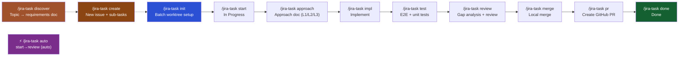

# jiraflow · Coding Agent Plugin


[](#)
[](LICENSE)
[](https://docs.anthropic.com/en/docs/claude-code)
[](https://github.com/sooperset/mcp-atlassian)

> **Automate your entire dev workflow — from Jira issue to merged PR — inside Claude Code.**

---

## Why This Plugin?

Most Jira + AI tools stop at CRUD (read/create/update issues). This plugin automates the **entire development lifecycle**: approach → implementation → testing → review → PR → done, with every step synced back to Jira automatically.

| | **This Plugin** | Atlassian Official AI | netresearch/jira-skill |
|---|:---:|:---:|:---:|
| Jira MCP integration | ✅ | ✅ | ❌ Python scripts |
| Full PDCA lifecycle | ✅ | ❌ code gen only | ❌ CRUD only |
| Multi-task branch setup | ✅ | ❌ | ❌ |
| Auto Jira status transitions | ✅ | ✅ | manual |
| Approach / Test docs | ✅ | ❌ | ❌ |
| Approach-Impl gap analysis | ✅ | ❌ | ❌ |
| Iterative review (auto-fix + retry) | ✅ | ❌ | ❌ |
| Progress tracking across sessions | ✅ | ❌ | ❌ |

---

## Workflow



> **Discover (optional first step)**: `/jira-task discover "<topic>"` turns a free-form topic into a structured `docs/requirements/<slug>.requirements.md`, which `/jira-task create --from-requirements <file>` can then consume to bulk-register Epic/Story/Sub-tasks.

> **Shortcut**: `/jira-task auto <ID>` runs `start → approach → impl → test → review` automatically. Each step runs as an isolated sub-agent, and already-completed steps are skipped. If review fails, it auto-fixes and retries (up to 2×).

Each step automatically posts a comment and/or attachment to the Jira issue and transitions its status.

---

## Key Features

**Interactive Issue Creation** *(v0.12.0)*
`/jira-task create [hint]` registers a brand-new Jira issue from conversation context. If context is thin, it asks a few batched questions; if the scope warrants it, it proposes a sub-task breakdown (with `Blocks` links for dependencies so downstream `init` can auto-detect ready-to-start sub-tasks). Supports linking to an existing epic.
- **No raw `jira_create_issue` footguns**: the skill encodes the exact `mcp-atlassian` schema (e.g. `additional_fields` is a JSON string, `parent` is a bare key, `priority` is `{"name": "..."}`, `components` is a CSV string, `assignee` must be top-level).
- **Auto sub-task decision**: the skill judges whether to split based on scope; no flag needed.
- **Silent-skip guard**: re-fetches created issues to verify priority/labels actually landed (unknown `additional_fields` keys are otherwise dropped with only a warning).

**Auto Mode** *(v0.9.0)*
`/jira-task auto PROJ-123` runs the full `start → approach → impl → test → review` pipeline automatically.
- **Sub-agent isolation**: Each step runs as an independent sub-agent, preventing context pollution between stages.
- **Iterative review**: When review finds issues (gap analysis or code quality), auto-fix → test → review retries up to 2 times before stopping.
- **Smart resume**: Already-completed steps are skipped based on `.jira-context.json`.
- **Scope boundary**: `merge`, `pr`, `done` are excluded (cross-worktree / externally visible actions require manual confirmation).

**Interactive Setup Wizard** *(v0.6.0)*
`/jira setup` guides you through prerequisites (uv, Python 3.10+), credential collection, MCP server registration, and connection validation — no manual CLI commands needed.

**Multi-Task Branch Setup** *(v0.7.0)*
`/jira-task init` supports three argument modes: count (`init 5` — bulk setup), issue key (`init PROJ-123` — sub-task analysis), or natural language (`init "auth-related tasks"` — filtered search). Creates a `feature/<TASK-ID>` branch for each task.

**Document Auto-generation**
Generates requirements / approach / test report / review / PR description documents from dedicated templates under `templates/`, then immediately posts them as Jira attachments and comments via `scripts/jira-attach.sh`. No copy-paste required.

**Reviewer Calibration Log** *(v0.22.x)*
Each `/jira-task review` run appends a structured entry to `docs/review-log/` (redacted per the project's policy). `scripts/analyze-review-log.py` aggregates pass/fail rates and recurring findings over time so reviewer behavior doesn't silently drift toward self-praise.

**Status Transition Automation**
`start` → In Progress, `merge` → In Review, `done` → Done. Jira stays up to date without opening a browser.

**Approach-Impl Gap Analysis**
`/jira-task review` compares your approach document against actual code changes and flags discrepancies alongside code quality issues.

**Session Continuity**
Progress is tracked in `.jira-context.json`. Reopen Claude Code anytime and see exactly where you left off:
```
Progress: init ✓ → start ✓ → approach ✓ → impl → test → review → merge → pr → done
```

---

## Prerequisites

| Requirement | Required | Purpose |
|---|:---:|---|
| [Claude Code](https://docs.anthropic.com/en/docs/claude-code) | Yes | CLI environment |
| Python 3.10+ + [uv](https://docs.astral.sh/uv/) | Yes | Run MCP server (`uvx mcp-atlassian`) |
| [Git](https://git-scm.com/) | Yes | Branch / worktree management |
| Jira Cloud account + API Token | Yes | Jira integration |
| [GitHub CLI (`gh`)](https://cli.github.com/) | PR step only | Create GitHub PRs |

---

## Quick Start

### One-shot install (all agents)

```bash
git clone https://github.com/panicDev/jiraflow.git
cd jiraflow
bash install.sh
```

Prompts for agent type (Claude Code / Codex / OpenCode / other), Jira credentials, and tests connectivity. Registers the MCP server for Claude Code or writes a `.env` file for other agents.

### Claude Code (marketplace)

```bash
# 1. Install the plugin
claude plugin marketplace add panicDev/jiraflow
claude plugin install jiraflow

# 2. Register the Atlassian MCP server
claude mcp add atlassian \
  -e JIRA_URL=https://your-domain.atlassian.net \
  -e JIRA_USERNAME=your-email@company.com \
  -e JIRA_API_TOKEN=your-api-token \
  -e JIRA_PROJECTS_FILTER=PROJ \
  -- uvx mcp-atlassian

# 3. Verify connection
claude
> /jira

# 4a. (Optional) Create a brand-new issue interactively
> Add OTP secondary authentication to /jira-task create auth module # → parent + sub-tasks + Blocks links

# 4b. Fetch your top tasks and set up worktrees
> /jira-task init 5

# 5a. Auto mode — run the full pipeline in one command
> git checkout feature/PROJ-123
> /jira-task auto       # start → approach → impl → test → review

# 5b. Or step-by-step (TASK-ID is auto-detected from branch name)
> /jira-task start      # Transition to In Progress
> /jira-task approach   # Generate approach doc (L1/L2/L3)
> /jira-task impl       # Implement based on approach
> /jira-task test       # Run tests + post report to Jira
> /jira-task review     # Gap analysis + code review
> /jira-task merge      # Merge locally (choose strategy)

# 6. Back on base branch
> git checkout develop  # or main/master
> /jira-task pr         # Push branch + create GitHub PR
> /jira-task done       # Transition to Done + post summary
```

---

## Setup

### Step 1: Install the Plugin

```bash
claude plugin marketplace add panicDev/jiraflow
claude plugin install jiraflow

# For local dev / testing:
claude --plugin-dir /path/to/jiraflow
```

> **Tip**: Instead of running `claude mcp add` manually, you can use the interactive wizard after installing the plugin:
> ```
> > /jira setup
> ```
> The wizard checks prerequisites, collects your credentials, registers the MCP server, and validates the connection.

### Step 2: Create a Jira API Token

1. Go to https://id.atlassian.com/manage-profile/security/api-tokens
2. Click **"Create API token"**
3. Enter a label (e.g. `claude-code`) → **Create**
4. Copy the token (shown only once)

### Step 3: Register the MCP Server

```bash
claude mcp add atlassian \
  -e JIRA_URL=https://your-domain.atlassian.net \
  -e JIRA_USERNAME=your-email@company.com \
  -e JIRA_API_TOKEN=your-api-token \
  -e JIRA_PROJECTS_FILTER=PROJ \
  -- uvx mcp-atlassian
```

This saves credentials to `.claude/settings.local.json`. **Add it to `.gitignore`**:
```
.claude/settings.local.json
```

| Variable | Required | Description |
|---|:---:|---|
| `JIRA_URL` | Yes | Jira Cloud URL (no trailing `/`) |
| `JIRA_USERNAME` | Yes | Atlassian account email |
| `JIRA_API_TOKEN` | Yes | API token from Step 2 |
| `JIRA_PROJECTS_FILTER` | No | Comma-separated project keys (e.g. `PROJ,DEV`) |

### Step 4: Verify Connection

```bash
claude
> /jira
```

---

## Other Agents

jiraflow works with any coding agent that can read markdown files and run shell commands.

### Codex

`.codex-plugin/plugin.json` is the plugin manifest. No additional install step — Codex auto-discovers it.

Set env vars and point to the plugin root:
```bash
export JIRA_URL=https://your-domain.atlassian.net
export JIRA_USERNAME=your-email@company.com
export JIRA_API_TOKEN=your-api-token
export JIRAFLOW_ROOT=/path/to/jiraflow
```

Then ask Codex to read `skills/using-jiraflow/SKILL.md` to get started.

### OpenCode

See `.opencode/INSTALL.md` for setup. Set the same env vars above, then load `skills/using-jiraflow/SKILL.md`.

### Gemini CLI

`GEMINI.md` auto-loads `skills/using-jiraflow/SKILL.md` at session start. Set env vars as above. MCP server setup follows [mcp-atlassian docs](https://github.com/sooperset/mcp-atlassian).

### Pi (earendil-works/pi) and others

`AGENTS.md` provides universal agent instructions: skill routing table, tool name mapping, and TASK-ID auto-detection. Any agent that reads `AGENTS.md` at session start can run the full workflow.

Tool name mapping (see `AGENTS.md` for full table):

| Skill uses | Generic equivalent |
|-----------|-------------------|
| `Read` | read file |
| `Write` | write file / create file |
| `Edit` | replace in file |
| `Bash` | run shell command |
| `Skill` | read the `.md` file and follow it |

---

## Commands

| Command | Run from | Description |
|---|---|---|
| `/jira` | anywhere | Connection status + help |
| `/jira setup` | anywhere | **Interactive setup wizard** (prerequisites → credentials → MCP registration → validation) |
| `/jira-task discover [topic]` | anywhere | **Turn a free-form topic into a requirements doc** (`docs/requirements/<slug>.requirements.md`) for `/jira-task create --from-requirements` |
| `/jira-task create [hint]` | anywhere | **Interactively create a new Jira issue** with optional sub-tasks, dependency links, and epic linking |
| `/jira-task init [N\|KEY\|desc]` | main repo | Fetch tasks + create feature branches (count, issue key, or natural language) |
| `/jira-task auto <ID>` | feature branch | **Auto-run full pipeline** with sub-agent isolation + iterative review |
| `/jira-task start [ID]` | feature branch | Start task (checkout branch, In Progress) |
| `/jira-task approach [ID]` | feature branch | Generate `docs/approach/<ID>.approach.md` (L1/L2/L3 level-aware; replaces plan+design) |
| `/jira-task impl [ID]` | feature branch | Implement based on approach doc |
| `/jira-task test [ID]` | feature branch | Run tests + post report to Jira |
| `/jira-task review [ID]` | feature branch | Gap analysis + code review → Jira |
| `/jira-task merge [ID]` | feature branch | Merge locally into base (strategy: ff/squash/rebase) |
| `/jira-task pr [ID]` | base branch | Push branch + create GitHub PR |
| `/jira-task done [ID]` | base branch | Transition Done + post summary |
| `/jira-task clean <ID...>\|--all\|--list` | anywhere | Delete feature branches for completed tasks |
| `/jira-task report` | anywhere | My assigned issues status report |
| `/jira-task status` | anywhere | Current active task status |

### TASK-ID Auto-detection

`[ID]` can be omitted when on a feature branch. Resolved in this order:

1. Git branch name: `feature/PROJ-123` → `PROJ-123`
2. Current directory name matching `[A-Z]+-\d+`
3. `.jira-context.json` active task ID

---

## Project Structure

```
jiraflow/
├── .claude-plugin/
│   ├── plugin.json              # Plugin manifest (Claude Code)
│   └── marketplace.json
├── .codex-plugin/
│   └── plugin.json              # Plugin manifest (Codex)
├── .opencode/
│   └── INSTALL.md               # Install guide (OpenCode)
├── CLAUDE.md                    # Claude Code behavior instructions
├── AGENTS.md                    # Universal agent instructions (Codex, Pi, etc.)
├── GEMINI.md                    # Gemini CLI entrypoint
│
├── commands/
│   ├── jira.md                  # /jira
│   ├── jira-task.md             # /jira-task (router)
│   └── dashboard.md             # /dashboard (alias of /jira dashboard)
│
├── skills/                      # One SKILL.md per workflow step
│   │                            # Heavy SKILLs use refs/ for split details:
│   │                            #   skills/<name>/refs/<topic>.md is loaded
│   │                            #   on demand by Read, not into the system
│   │                            #   prompt. See SKILL bodies for explicit
│   │                            #   `Read skills/<name>/refs/...` calls.
│ ├── _shared/ # public snippets such as script-lookup.md
│   ├── jira-setup/              # interactive setup wizard
│ ├── jira-dashboard/ # /jira dashboard routing SKILL
│   ├── jira-task-discover/      # topic → requirements doc
│   │   └── refs/                # conflict-detection / synthesis-confirm / trace-markers
│   ├── jira-task-create/        # interactive issue creation
│   │   └── refs/                # mcp-schema / from-requirements-mode
│   ├── using-jiraflow/           # bootstrap skill (universal agent entrypoint)
│   ├── jira-task-init/
│   │   └── refs/                # issue-key-mode / worktree-creation
│   ├── jira-task-auto/          # auto-run full pipeline
│   ├── jira-task-start/
│   ├── jira-task-approach/      # level-aware approach doc (replaces plan+design)
│   ├── jira-task-impl/
│   ├── jira-task-test/
│   ├── jira-task-review/        # heavy logic extracted to scripts/append-review-log.py
│   ├── jira-local-merge/
│   ├── jira-task-pr/
│   ├── jira-task-done/
│   ├── jira-task-clean/
│   └── jira-task-report/
│
├── agents/                      # Subagent definitions
│   └── jira-reviewer.md         # Gap analysis + code quality (forced delegation, opus)
│
├── hooks/                       # Session event hooks
│   ├── hooks.json
│   └── scripts/
│       ├── session-start.js         # Show active task on startup
│       ├── stop-sync.js             # Remind to sync Jira on exit
│       ├── dashboard-ingest.sh      # Forward UserPromptSubmit/PreToolUse/PostToolUse/SubagentStop/Notification → POST /ingest
│       ├── dashboard-ingest.test.sh # Unit test for dashboard-ingest.sh
│       ├── stop-ingest.sh           # Forward Stop event (extracts last assistant text from transcript)
│       ├── phase-gate.js            # Phase dependency hook (disabled by default)
│       ├── phase-gate.config.json
│       ├── phase-gate.test.js
│       └── phase-gate.scenarios.test.js
│
├── scripts/                     # Helper scripts invoked by skills
│   ├── jira-attach.sh             # Upload attachments via Jira REST API
│ ├── jira-context-update.py # merge/done: completedSteps/status synchronization
│   ├── clean-worktree.py          # Worktree/branch cleanup helper
│ ├── cleanup-worktree-mcp.py # done: Worktree unit MCP config cleanup
│   ├── analyze-review-log.py      # Reviewer calibration log analyzer
│   ├── append-review-log.py       # /jira-task review: append entry to review-log
│   ├── append-review-log-wrapper.sh # review SKILL → append-review-log.py wrapper
│   ├── propagate-mcp-config.sh    # /jira-task init: propagate MCP config to worktree
│ ├── dashboard-control.sh # /jira dashboard start/stop/status/setup control
│ ├── dashboard/ # Dashboard server + React SPA source
│   └── review_log/                # Stored reviewer calibration entries
│
├── templates/                   # Document templates per workflow step
│   ├── requirements.template.md
│   ├── approach.template.md
│   ├── test-report.template.md
│   ├── review.template.md
│   ├── pr-description.template.md
│   └── report.template.md
│
├── docs/                        # Plugin reference docs
│   ├── mcp-atlassian-tools.md   # Tool reference for the Atlassian MCP server
│   └── review-log/              # Review log schema + sample entries
│                                # (PDCA outputs approach/test/review/
│                                #  requirements are gitignored as
│                                #  per-task artifacts)
│
└── tests/                       # Python tests for analyze-review-log
    ├── test_analyze_review_log.py
    └── fixtures/
```

### Phase Gate (Experimental — currently disabled)

A PreToolUse hook that enforces the `/jira-task` step calling order is included in the codebase, but is **disabled by default**. To activate it, you must explicitly register the hook.

**Implemented** (Phase 1.2.1 ~ 1.2.4)

- `hooks/scripts/phase-gate.config.json` — 12 phase dependency graph + artifact pattern
- `hooks/scripts/phase-gate.js` — Node hook script (blocked when dependencies are not met, fail-open design)
- `hooks/scripts/phase-gate.test.js`, `phase-gate.scenarios.test.js` — Unit 20 + Scenario 5 Test
- bypass mechanism: `JIRA_PHASE_GATE_BYPASS=1` (one-time), `bypassGate: true` in `.jira-context.json` (persistent)

**Why is it disabled**

This plugin was originally designed as a "toolkit for picking and choosing the steps you want" (omitting approach for small fixes, omitting impl for document work, etc.). Turning on phase-gate breaks this flexibility by forcing all adjacent phases to be preconditions. Therefore, we leave it disabled so that only teams that want to force a linear workflow can turn it on explicitly.

**How ​​to activate**

Add the following entry to the `hooks` object in `hooks/hooks.json`:

```json
"PreToolUse": [
  {
    "matcher": "Skill",
    "hooks": [
      {
        "type": "command",
        "command": "node ${CLAUDE_PLUGIN_ROOT}/hooks/scripts/phase-gate.js",
        "timeout": 5
      }
    ]
  }
]
```

**Customize**

You can edit `phase-gate.config.json` to relax dependencies (empty `requires`), replace required artifacts, or turn off specific phases with `enforced: false`.

**Run test**

```bash
npm test   # unit 20 + scenarios 5
```

### Branch Layout

```
your-project/                      ← single repo
  branches:
    develop (or main/master)       ← base branch
    feature/PROJ-101               ← created by /jira-task init
    feature/PROJ-102
    feature/PROJ-103
```

`/jira-task start <ID>` checks out the feature branch. `/jira-task merge` merges it back into the base branch. No separate worktree directories needed.

---

## Multi-Branch Merge Strategy

When multiple tasks touch the same files, merging in the wrong order causes conflicts.

```
Check for file overlap at design time
├─ No overlap            → PR in any order
├─ Overlap (independent releases) → Sequential rebase-and-merge
└─ Overlap (release together)     → Integration branch strategy
```

Check before starting implementation:
```bash
git diff --name-only main feature/PROJ-101
git diff --name-only main feature/PROJ-102
```

Available merge strategies when running `/jira-task merge`:

| Strategy | Description | Equivalent GitHub option |
|---|---|---|
| `--no-ff` (default) | Merge commit, preserves branch history | Create a merge commit |
| `--squash` | Squash all commits into one | Squash and merge |
| `rebase` | Linear history, no merge commit | Rebase and merge |

---

## Troubleshooting

**"Atlassian MCP server not connected"**
```bash
claude mcp list                  # Check registered servers
claude mcp get atlassian         # Verify env vars
uvx mcp-atlassian                # Test server directly (Ctrl+C to stop)
pip install uv                   # Install uv if missing
```

**"Transition failed"**
```
"Show available transitions for PROJ-123"
```
Transition names vary by Jira workflow. Common names: `To Do`, `In Progress`, `In Review`, `Done`.

**"Authentication failed"**
- Verify `JIRA_USERNAME` matches your Atlassian account email exactly
- Confirm `JIRA_URL` has no trailing `/`
- Check if the API token has expired

**"`gh` CLI not found"**
```bash
# macOS
brew install gh && gh auth login

# Windows
winget install GitHub.cli && gh auth login
```

**Branch creation failed**
```bash
git rev-parse --git-dir          # Confirm you're in a git repo
git branch -a | grep feature/    # Check for existing branches
git fetch origin                 # Sync remote refs
```

---

## Dashboard

A real-time activity monitor for every Claude Code worktree in your workspace. Hook events from each session (user prompts, tool calls, sub-agent lifecycle, final responses) stream into a browser UI via SSE so you can see at a glance which session is busy, which is waiting on you, and what each one just answered.

### Quick Start (one click)

You can start Dashboard from within Claude Code with a single slash command:

```
/jira dashboard
```

When first run, npm dependencies are automatically installed and UI build is performed, and then the server is started.
On the second and subsequent runs, it will skip setup with cache detection and start right away.

| command | Action |
|--------|------|
| `/jira dashboard` | Check status → Automatic setup+start if stopped |
| `/jira dashboard start` | Start Dashboard |
| `/jira dashboard stop` | Stop Dashboard |
| `/jira dashboard status` | Current status inquiry (URL/PID/start time) |
| `/jira dashboard setup` | Only npm install dependencies and build UI |

The server binds to `http://127.0.0.1:8765`.

### Manual Run (Troubleshooting)

If you need to run it directly without the slash command:

```bash
# 1) Install root deps (express, chokidar)
npm install

# 2) Install web deps and build the SPA bundle into scripts/dashboard/public/
npm --prefix scripts/dashboard/web install
npm --prefix scripts/dashboard/web run build

# 3) Start the dashboard server
npm run dashboard
# or: node scripts/dashboard/server.js
```

After the first build, daily use is just `npm run dashboard`. Re-run the build step whenever the React source changes.

The server binds to `http://127.0.0.1:8765` and opens your default browser automatically.

```bash
DASHBOARD_NO_OPEN=1 npm run dashboard   # suppress auto-open (CI / headless)
PORT=9000 npm run dashboard              # override default port
```

### What you see on each card

- **Header** — Jira task id (or directory name when no Jira context), issue type, **outlined status badge with leading dot** (Jira workflow status, distinct from agent activity), `⚙ N` cumulative tool calls in this session, `X minutes ago` last activity, and badges for `⏵ waiting for response` / `stale` / `⛔ blocked × N`.
- **SDLC stepper** — One chip per `/jira-task` step (init/start/approach/impl/test/review/merge/pr/done) coloured by `completedSteps` in `.jira-context.json`. Skipped intermediate steps after `done` are shown with strikethrough.
- **Activity panel** — Last prompt, **Last response (final concluding line of Claude's reply)**, current tool-in-flight, sub-agent indicator, and a blocked flag. Prompt/response signals are persisted on the server independent of the activity ring buffer so they survive long tool-call bursts.
- **Issue links** — Below the meta row, `blocks` / `blocked by` chips show related issue keys. Open blockers are highlighted; resolved ones are struck through.
- **Card border state**:
  - **Blue glow + pulse** = busy. Defined as "a `UserPromptSubmit` event without a matching `Stop` yet" — i.e. Claude is generating right now. Time-independent.
  - **Amber glow + pulse + waiting for response badge** = busy *and* most recent `Notification` mentions permission/input/waiting.
  - **Red left stripe + `⛔ blocked` badge** = at least one un-resolved `is blocked by` link.
  - **Dim + `stale` badge** = Jira status is complete but the worktree still exists (cleanup candidate).
- **Header bar (KITT)** — Top of viewport scans left-right while connected (SSE live). The connection chip in the top-right fills bottom-up to indicate countdown to the next jira-collector poll.
- **Sort & filter** — Header has chips for sort key (activity / taskId / summary) and a search field that matches taskId / summary / branch / path.
- **View toggle: Cards ↔ Graph** *(v0.30.x)* — Header has a Cards / Graph toggle. Graph mode renders worktrees as a force-directed graph (react-flow + d3-force) showing `blocks` / `parent` / `epic` relationships with color-coded edges, marching-ants flow direction, and arrow markers. Parent/epic edges anchor the hierarchy (parent on top, children below); blocks edges connect siblings. Click a node → side panel with the full WorktreeCard. Drag a node → it pins in place (simulation won't drag it back). Status/assignee chip filters dim non-matches; isolated nodes get a dashed border; cycle members get heavier red dashes.
- **Cleanup button** *(v0.30.x)* — Cards in `stale` state (Jira `finished` but worktree alive) get a `🗑 Cleanup` floating button on hover at the bottom-right. Click → confirm → server runs `git worktree remove` + `git branch -d`. Backend safety: only registered worktrees, only when status is done, dirty trees rejected, branch name read from store (no body injection).
- **Cards without Jira context** (e.g. main repo while running `/jira dashboard`) show only directory + path + activity, with stepper and Jira-only fields hidden.

### Hooks

Hook events are wired in `hooks/hooks.json`, forwarded by two small scripts in `hooks/scripts/` to `POST /ingest`, then broadcast via SSE:

| Hook | Forwarder | Used for |
|------|-----------|----------|
| `UserPromptSubmit` | `dashboard-ingest.sh` | Last prompt + busy detection |
| `PreToolUse` | `dashboard-ingest.sh` | Current tool, tool-call counter |
| `PostToolUse` | `dashboard-ingest.sh` | Closes a tool-in-flight marker |
| `SubagentStop` | `dashboard-ingest.sh` | Sub-agent active indicator |
| `Notification` | `dashboard-ingest.sh` | Awaiting / blocked detection |
| `Stop` | `stop-ingest.sh` | Last response preview (reads `transcript_path`) |

Each ingest is mapped to a worktree path and Jira task id via `.jira-context.json`. `SessionStart` and `Stop` also drive non-dashboard side-effects (Jira context injection, end-of-session reminder) — those forwarders are independent.

### Logs

Log file: `<workspaceRoot>/logs/dashboard-server.log`

- Append-only JSON Lines format; no rotation in this release.
- Sensitive fields (`apiToken`, `Authorization`) are automatically redacted to `[REDACTED]` before writing.
- The server prints the absolute log path to stdout on startup.

### Out of Scope

- Log rotation / size capping
- Authentication / remote access (currently localhost-only by design)
- Browser env var (`BROWSER`) support on Linux
- Windows PowerShell fallback (current: `cmd /c start`)
- Fallback stdout URL prompt on browser-open failure

---

## Roadmap

- [x] Interactive setup wizard: `/jira setup` *(v0.6.0)*
- [x] Auto mode: `/jira-task auto` *(v0.6.0)*
- [x] Init argument expansion: count, issue key, natural language *(v0.7.0)*
- [x] Iterative review: auto-fix + test + review retry loop *(v0.8.0)*
- [x] Sub-agent isolation: each auto step in independent context *(v0.9.0)*
- [x] Interactive issue creation: `/jira-task create` *(v0.12.0)*
- [x] Requirements discovery: `/jira-task discover` → `docs/requirements/<slug>.requirements.md` *(v1.1.x)*
- [x] Reviewer calibration log: review history analyzer (`scripts/analyze-review-log.py`) *(v0.22.x)*
- [x] SKILL bloat refactor: 4 heavy SKILLs (create/discover/init/review) compressed from 1,989 → 921 lines (-54%) via `skills/<name>/refs/` split + script extraction *(v0.24.0)*
- [x] Dashboard graph view: react-flow + d3-force visualization of `blocks` / `parent` / `epic` relationships with hierarchical force layout, drag-to-pin, status/assignee filters, isolated/cycle highlighting *(v0.30.x — Epic MAE-249)*
- [x] Dashboard worktree cleanup button: in-card `🗑 Cleanup` floating action for stale worktrees, with safety guards on the backend `POST /cleanup` *(v0.30.x)*
- [x] Plan + Design → unified `/jira-task approach` (level-aware L1/L2/L3 sizing) *(v0.33.0 — MAE-350)*
- [x] L3 Epic empty-child sequencing guard for `/jira-task auto` (early exit + guidance) *(v0.34.0 — MAE-364)*
- [x] Auto SKILL.md hygiene: Scope Shortfall source trail + PDCA automatic branching guide *(v0.34.0 — MAE-366)*
- [x] No-worktree branch model: `feature/<TASK-ID>` branches instead of git worktrees *(v0.1.2)*
- [x] Multi-agent support: Codex, OpenCode, Gemini CLI, Pi — via `AGENTS.md`, `GEMINI.md`, `.codex-plugin/`, `.opencode/` *(v0.1.3)*
- [x] Parallel sub-agent implementation: independent work packages on same branch via Agent tool *(v0.1.2)*
- [x] Time tracking: auto-log work session duration to Jira worklog on `/jira-task done` *(v0.1.3)*
- [ ] Bitbucket Cloud + GitLab MR support for `/jira-task pr`
- [ ] Jira Server / Data Center (Personal Access Token)
- [ ] Sub-task auto-creation from approach doc task breakdown
- [ ] Time tracking: auto-log work sessions to Jira
- [ ] CI/CD result posting (GitHub Actions, Bitbucket Pipelines)
- [ ] Slack / Teams notifications on PR creation and task completion
- [ ] English documentation for all templates

---

## License

MIT

