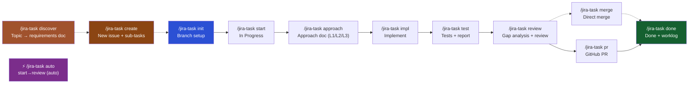

# jiraflow · Coding Agent Plugin

[](#)
[](LICENSE)
[](https://docs.anthropic.com/en/docs/claude-code)
[](https://github.com/sooperset/mcp-atlassian)

> **Automate your entire dev workflow — from Jira issue to merged PR — inside your coding agent.**

---

## Why jiraflow?

Most Jira + AI integrations stop at CRUD. jiraflow automates the **full development lifecycle**: discover → approach → implement → test → review → PR → done, with every step synced back to Jira automatically. Works with Claude Code, Codex, Gemini CLI, OpenCode, CommandCode, and any agent that reads markdown.

| | **jiraflow** | Atlassian AI | Generic Jira skill |
|---|:---:|:---:|:---:|
| Full SDLC automation | ✅ | ❌ code gen only | ❌ CRUD only |
| Multi-agent support | ✅ | ❌ | ❌ |
| Auto Jira transitions | ✅ | ✅ | manual |
| Approach / Test docs | ✅ | ❌ | ❌ |
| Approach-impl gap analysis | ✅ | ❌ | ❌ |
| Iterative review (auto-fix + retry) | ✅ | ❌ | ❌ |
| Time tracking (auto-log to Jira) | ✅ | ❌ | ❌ |
| Progress tracking across sessions | ✅ | ❌ | ❌ |

---

## Workflow



**Discover** (optional): `/jira-task discover "<topic>"` turns a free-form topic into `docs/requirements/<slug>.requirements.md`, which `/jira-task create --from-requirements` consumes to bulk-register Epic/Story/Sub-tasks.

**Shortcut**: `/jira-task auto <ID>` chains `start → approach → impl → test → review` automatically. Each step runs as an isolated sub-agent. Completed steps are skipped. If review fails, it auto-fixes and retries up to 2×.

---

## Key Features

**Level-aware Approach Docs**
`/jira-task approach` generates a single unified plan+design document scaled to task size:
- **L1** (Bug/Task): 5-line compact format — areas of change, key decisions, risk, rollback
- **L2** (Story): one-page format — architecture sketch, implementation plan per file, key decisions, test plan
- **L3** (Epic): sequencing-only — child story list with dependency/order/parallelability

L2 approach docs offer sub-task auto-creation: the implementation plan table is parsed and proposed as Jira sub-tasks under the parent issue.

**Auto Mode**
`/jira-task auto PROJ-123` runs the full `start → approach → impl → test → review` pipeline.
- Each step runs as an independent sub-agent — no context pollution between stages
- Iterative review: auto-fix → test → re-review, up to 2 retries
- Smart resume: skips steps already in `completedSteps` from `.jira-context.json`
- `merge`, `pr`, `done` excluded from auto — those touch shared/external state and need manual confirmation

**Time Tracking**
`/jira-task done` automatically logs the elapsed session time to Jira worklog (`startAt` recorded on `start`, duration computed on `done`). No manual time entry needed.

**Interactive Issue Creation**
`/jira-task create [hint]` registers a new Jira issue from conversation context. Thin context triggers batched follow-up questions; large scope triggers sub-task breakdown with `Blocks` dependency links.

**Interactive Setup Wizard**
`/jira setup` walks through prerequisites (uv, Python 3.10+), credential collection, MCP server registration, and connection validation. No manual CLI commands needed.

**Multi-Task Branch Setup**
`/jira-task init` supports three modes: count (`init 5`), issue key (`init PROJ-123`), or natural language (`init "auth-related tasks"`). Creates `feature/<TASK-ID>` branches — no separate working directories.

**Approach-Impl Gap Analysis**
`/jira-task review` compares the approach document against actual code changes and flags discrepancies alongside code quality findings.

**Reviewer Calibration Log**
Each `/jira-task review` appends a structured entry to `docs/review-log/`. `scripts/analyze-review-log.py` aggregates pass/fail rates over time so reviewer behavior doesn't silently drift.

**Session Continuity**
Progress tracked in `.jira-context.json`. Reopen Claude Code and see exactly where you left off:
```
Progress: init ✓ → start ✓ → approach ✓ → impl → test → review → pr → done
```

---

## Prerequisites

| Requirement | Required | Purpose |
|---|:---:|---|
| [Claude Code](https://docs.anthropic.com/en/docs/claude-code) | Yes (or other agent) | CLI environment |
| Python 3.10+ + [uv](https://docs.astral.sh/uv/) | Yes | Run MCP server (`uvx mcp-atlassian`) |
| [Git](https://git-scm.com/) | Yes | Branch management |
| Jira Cloud account + API Token | Yes | Jira integration |
| [GitHub CLI (`gh`)](https://cli.github.com/) | PR step only | Create GitHub PRs |

---

## Quick Start

### One-shot install

```bash
curl -fsSL https://raw.githubusercontent.com/panicDev/jiraflow/main/install.sh | bash
```

Clones the repo (default: `~/.local/share/jiraflow`), prompts for agent type and Jira credentials, tests connectivity, then registers the MCP server (Claude Code) or writes a `.env` (other agents).

Already have the repo cloned? Run locally instead:

```bash
bash install.sh
```

### Claude Code — verify after install

```bash
claude
> /jira
```

### Manual MCP setup

```bash
claude mcp add atlassian \
  -e JIRA_URL=https://your-domain.atlassian.net \
  -e JIRA_USERNAME=your-email@company.com \
  -e JIRA_API_TOKEN=your-api-token \
  -e JIRA_PROJECTS_FILTER=PROJ \
  -- uvx mcp-atlassian
```

### Typical session

```bash
# Fetch top tasks and create feature branches
> /jira-task init 5

# Auto mode — full pipeline in one command
> git checkout feature/PROJ-123
> /jira-task auto       # start → approach → impl → test → review

# Or step-by-step (TASK-ID auto-detected from branch name)
> /jira-task start      # Transition to In Progress
> /jira-task approach   # Generate approach doc (L1/L2/L3)
> /jira-task impl       # Implement based on approach
> /jira-task test       # Run tests + post report to Jira
> /jira-task review     # Gap analysis + code review

# Back on base branch — choose one path:
> /jira-task pr         # Push feature branch + create GitHub PR  (PR path)
# OR
> /jira-task merge      # Merge locally without PR  (direct merge path)

> /jira-task done       # Transition Done + log work time
```

---

## Setup

### Step 1: Install the Plugin

**Recommended (one-shot)**:
```bash
curl -fsSL https://raw.githubusercontent.com/panicDev/jiraflow/main/install.sh | bash
```

**Already cloned**:
```bash
bash /path/to/jiraflow/install.sh
```

> **Tip**: The interactive wizard (`/jira setup`) can also handle MCP registration and validation after install.

### Step 2: Create a Jira API Token

1. Go to https://id.atlassian.com/manage-profile/security/api-tokens
2. Click **"Create API token"** → label it (e.g. `claude-code`) → **Create**
3. Copy the token (shown once)

### Step 3: Register the MCP Server

```bash
claude mcp add atlassian \
  -e JIRA_URL=https://your-domain.atlassian.net \
  -e JIRA_USERNAME=your-email@company.com \
  -e JIRA_API_TOKEN=your-api-token \
  -e JIRA_PROJECTS_FILTER=PROJ \
  -- uvx mcp-atlassian
```

Credentials saved to `.claude/settings.local.json` — add to `.gitignore`.

| Variable | Required | Description |
|---|:---:|---|
| `JIRA_URL` | Yes | Jira Cloud URL (no trailing `/`) |
| `JIRA_USERNAME` | Yes | Atlassian account email |
| `JIRA_API_TOKEN` | Yes | API token from Step 2 |
| `JIRA_PROJECTS_FILTER` | No | Comma-separated project keys (e.g. `PROJ,DEV`) |

### Step 4: Verify

```bash
claude
> /jira
```

---

## Other Agents

jiraflow works with any coding agent that can read markdown and run shell commands.

### Codex

`.codex-plugin/plugin.json` is auto-discovered by Codex. Set env vars:

```bash
export JIRA_URL=https://your-domain.atlassian.net
export JIRA_USERNAME=your-email@company.com
export JIRA_API_TOKEN=your-api-token
export JIRAFLOW_ROOT=/path/to/jiraflow
```

Ask Codex to read `skills/using-jiraflow/SKILL.md` to start.

### OpenCode

See `.opencode/INSTALL.md`. Set the same env vars above, then load `skills/using-jiraflow/SKILL.md`.

### Gemini CLI

`GEMINI.md` auto-loads `skills/using-jiraflow/SKILL.md` at session start. Set env vars as above. MCP server setup follows [mcp-atlassian docs](https://github.com/sooperset/mcp-atlassian).

### CommandCode

`.commandcode/skills/jiraflow/SKILL.md` is auto-discovered via `/skills`. Set the same env vars, then invoke `jiraflow` from the skills menu.

`AGENTS.md` is also read automatically as project instructions.

### Universal (Pi and others)

`AGENTS.md` provides full agent instructions: skill routing table, tool name mapping, and TASK-ID auto-detection. Any agent that reads `AGENTS.md` at session start can run the full workflow.

| Skill uses | Generic equivalent |
|-----------|-------------------|
| `Read` | read file |
| `Write` | write / create file |
| `Edit` | replace in file |
| `Bash` | run shell command |
| `Skill` | read the `.md` file and follow it |

---

## Commands

| Command | Run from | Description |
|---|---|---|
| `/jira` | anywhere | Connection status + help |
| `/jira setup` | anywhere | Interactive setup wizard |
| `/jira-task discover [topic]` | anywhere | Topic → `docs/requirements/<slug>.requirements.md` |
| `/jira-task create [hint]` | anywhere | Interactively create a new Jira issue with optional sub-tasks |
| `/jira-task init [N\|KEY\|desc]` | main branch | Fetch tasks + create feature branches |
| `/jira-task auto <ID>` | feature branch | Auto-run full pipeline with sub-agent isolation |
| `/jira-task start [ID]` | feature branch | Checkout branch + transition In Progress |
| `/jira-task approach [ID]` | feature branch | Generate approach doc (L1/L2/L3) |
| `/jira-task impl [ID]` | feature branch | Implement from approach doc |
| `/jira-task test [ID]` | feature branch | Run tests + post report to Jira |
| `/jira-task review [ID]` | feature branch | Gap analysis + code review |
| `/jira-task merge [ID]` | feature branch | Merge into base branch |
| `/jira-task pr [ID]` | base branch | Push + create GitHub PR |
| `/jira-task done [ID]` | base branch | Transition Done + log work time |
| `/jira-task status` | anywhere | Rich view of active tasks + progress |
| `/jira-task clean <ID...>\|--all\|--list` | anywhere | Delete feature branches for completed tasks |
| `/jira-task report` | anywhere | Assigned issues status report |

### TASK-ID Auto-detection

`[ID]` omittable when on a feature branch. Resolved in order:
1. Git branch name: `feature/PROJ-123` → `PROJ-123`
2. `.jira-context.json` active task ID

---

## Project Structure

```
jiraflow/
├── .claude-plugin/plugin.json     # Plugin manifest (Claude Code)
├── .codex-plugin/plugin.json      # Plugin manifest (Codex)
├── .commandcode/skills/jiraflow/  # CommandCode skill entry
├── .opencode/INSTALL.md           # OpenCode install guide
├── CLAUDE.md                      # Claude Code behavior instructions
├── AGENTS.md                      # Universal agent instructions
├── GEMINI.md                      # Gemini CLI entrypoint
│
├── commands/
│   ├── jira.md                    # /jira
│   ├── jira-task.md               # /jira-task (router)
│   └── dashboard.md               # /dashboard
│
├── skills/                        # One SKILL.md per workflow step
│   ├── _shared/                   # script-lookup.md, context-update.md
│   ├── using-jiraflow/            # Bootstrap skill (universal entrypoint)
│   ├── jira-setup/
│   ├── jira-dashboard/
│   ├── jira-task-discover/
│   ├── jira-task-create/
│   ├── jira-task-init/
│   ├── jira-task-auto/
│   ├── jira-task-start/
│   ├── jira-task-approach/
│   ├── jira-task-impl/
│   ├── jira-task-test/
│   ├── jira-task-review/
│   ├── jira-local-merge/
│   ├── jira-task-pr/
│   ├── jira-task-done/
│   ├── jira-task-clean/
│   ├── jira-task-status/
│   └── jira-task-report/
│
├── agents/
│   └── jira-reviewer.md           # Gap analysis sub-agent (Opus)
│
├── hooks/
│   ├── hooks.json
│   └── scripts/
│       ├── session-start.js       # Show active task on startup
│       ├── stop-sync.js           # Remind to sync Jira on exit
│       ├── dashboard-ingest.sh    # Forward hook events → dashboard
│       └── phase-gate.js          # Phase dependency guard (disabled by default)
│
├── scripts/
│   ├── jira-attach.sh             # Upload attachments via Jira REST API
│   ├── jira-context-update.py     # completedSteps / status synchronization
│   ├── analyze-review-log.py      # Reviewer calibration analyzer
│   ├── dashboard-control.sh       # Dashboard start/stop/status
│   └── dashboard/                 # Dashboard server + React SPA
│
└── templates/
    ├── approach.template.md
    ├── test-report.template.md
    ├── review.template.md
    └── pr-description.template.md
```

---

## Branch Layout

```
your-project/
  branches:
    develop (or main/master)   ← base branch
    feature/PROJ-101           ← created by /jira-task init
    feature/PROJ-102
    feature/PROJ-103
```

`/jira-task start <ID>` checks out the feature branch. `/jira-task merge` merges it back into base. No separate working directories.

---

## Multi-Branch Merge Strategy

When multiple tasks touch the same files, check overlap before starting:

```bash
git diff --name-only main feature/PROJ-101
git diff --name-only main feature/PROJ-102
```

| Strategy | Description | GitHub equivalent |
|---|---|---|
| `--no-ff` (default) | Merge commit, preserves branch history | Create a merge commit |
| `--squash` | All commits into one | Squash and merge |
| `rebase` | Linear history, no merge commit | Rebase and merge |

---

## Dashboard

Real-time activity monitor across all active Claude Code sessions. Hook events (prompts, tool calls, sub-agent lifecycle, responses) stream into a browser UI via SSE — see which session is busy, waiting, or blocked at a glance.

### Start

```
/jira dashboard
```

Auto-installs npm deps and builds the SPA on first run; subsequent runs skip setup.

| Command | Action |
|--------|------|
| `/jira dashboard` | Check status → start if stopped |
| `/jira dashboard start` | Start server |
| `/jira dashboard stop` | Stop server |
| `/jira dashboard status` | Show URL/PID/uptime |
| `/jira dashboard setup` | npm install + build only |

Server binds to `http://127.0.0.1:8765`.

### Manual Run

```bash
npm install
npm --prefix scripts/dashboard/web install
npm --prefix scripts/dashboard/web run build
npm run dashboard
```

```bash
DASHBOARD_NO_OPEN=1 npm run dashboard   # suppress browser open
PORT=9000 npm run dashboard              # override port
```

### What's on Each Card

- **Header** — Task ID, issue type, Jira status badge, cumulative tool calls, last activity, busy/blocked indicators
- **SDLC stepper** — One chip per `/jira-task` step colored by `completedSteps` in `.jira-context.json`
- **Activity panel** — Last prompt, last response (final line), current tool in flight, sub-agent indicator
- **Issue links** — `blocks` / `blocked by` chips; open blockers highlighted, resolved struck through
- **Card border state**:
  - Blue glow + pulse = Claude generating right now
  - Amber glow = generating + awaiting permission/input
  - Red stripe = unresolved `is blocked by` link
  - Dim + stale badge = Jira status complete, branch still exists

### Graph View

Header toggle switches from Cards to a force-directed graph (react-flow + d3-force) showing `blocks` / `parent` / `epic` relationships with color-coded edges. Click node → side panel. Drag node → pins in place.

### Hooks

| Hook | Purpose |
|------|---------|
| `UserPromptSubmit` | Last prompt + busy detection |
| `PreToolUse` | Current tool, call counter |
| `PostToolUse` | Closes tool-in-flight marker |
| `Stop` | Last response preview |
| `Notification` | Awaiting / blocked detection |

---

## Phase Gate (Experimental — disabled by default)

A `PreToolUse` hook that enforces `/jira-task` step order. Disabled by default because jiraflow is designed as a toolkit — you can skip steps (e.g. no approach for a trivial fix).

To activate, add to `hooks/hooks.json`:

```json
"PreToolUse": [
  {
    "matcher": "Skill",
    "hooks": [
      { "type": "command", "command": "node ${CLAUDE_PLUGIN_ROOT}/hooks/scripts/phase-gate.js", "timeout": 5 }
    ]
  }
]
```

Bypass: `JIRA_PHASE_GATE_BYPASS=1` (one-time) or `bypassGate: true` in `.jira-context.json` (persistent).

```bash
npm test   # 20 unit + 5 scenario tests
```

---

## Troubleshooting

**"Atlassian MCP server not connected"**
```bash
claude mcp list
claude mcp get atlassian
uvx mcp-atlassian          # test directly (Ctrl+C to stop)
```

**"Transition failed"**
```
> Show available transitions for PROJ-123
```
Transition names vary by Jira workflow: `To Do`, `In Progress`, `In Review`, `Done`.

**"Authentication failed"**
- `JIRA_USERNAME` must match Atlassian account email exactly
- `JIRA_URL` must have no trailing `/`
- Check if API token expired

**"`gh` not found"**
```bash
brew install gh && gh auth login      # macOS
winget install GitHub.cli && gh auth login  # Windows
```

**Branch creation failed**
```bash
git rev-parse --git-dir   # confirm git repo
git fetch origin          # sync refs
```

---

## Roadmap

- [x] Interactive setup wizard: `/jira setup`
- [x] Auto mode: `/jira-task auto` with sub-agent isolation + iterative review
- [x] Init: count / issue key / natural language argument modes
- [x] Interactive issue creation: `/jira-task create`
- [x] Requirements discovery: `/jira-task discover`
- [x] Reviewer calibration log + analyzer
- [x] Plan + Design → unified `/jira-task approach` (L1/L2/L3 level-aware)
- [x] Sub-task auto-creation from L2 approach implementation plan *(v0.1.3)*
- [x] No-worktree model: `feature/<TASK-ID>` branches *(v0.1.2)*
- [x] Multi-agent support: Codex, OpenCode, Gemini CLI, CommandCode, Pi *(v0.1.3)*
- [x] Time tracking: auto-log session duration to Jira worklog on `done` *(v0.1.3)*
- [x] Rich status view: `/jira-task status` with progress pipeline + elapsed time *(v0.1.3)*
- [ ] Bitbucket Cloud + GitLab MR support for `/jira-task pr`
- [ ] Jira Server / Data Center (Personal Access Token auth)
- [ ] CI/CD result posting (GitHub Actions, Bitbucket Pipelines)
- [ ] Slack / Teams notifications on PR creation and task completion

---

## License

MIT
